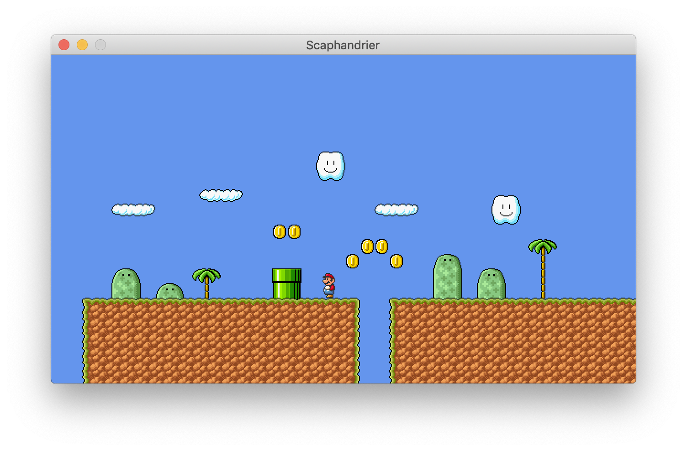
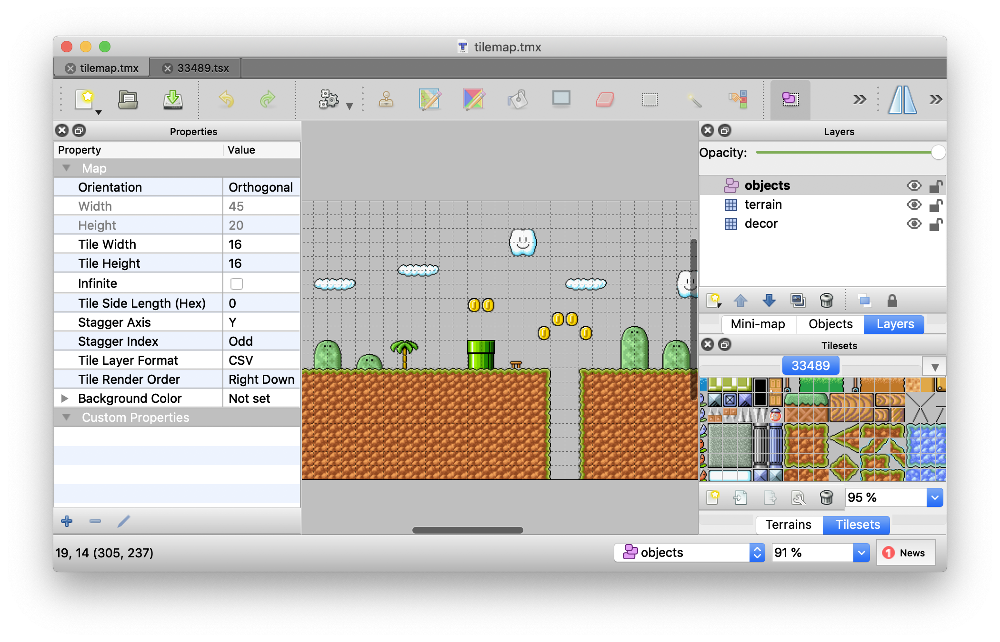
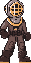
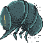

# Avancement

## Code

Réalisation d'une base de jeu de plateforme (\ref{1}). Le code C# est disponible sur GitHub (https://github.com/yopox/projet2A/) (dossier `mono/` pour le projet Visual Studio, la classe principale est `Game1.cs`).

Pour l'instant, nous avons fait la gestion du clavier (déplacement du personnage), les animations (marche, repos), défini quelques états pour les personnages (en train de marcher, au repos, en train de sauter), chargé les ressources graphiques, et fait un travail d'affichage (personnage, terrain). On peut modifier le terrain avec un éditeur de niveaux.

Avec l'éditeur de niveaux (\ref{2}) on peut créer un calque de terrain solide (il n'y a pas encore les collisions), un calque de décors, et un calque d'objets (pièces, position de départ, etc). On a défini ces 3 calques car ils répondent aux besoins basiques d'un jeu de plateforme (plateformes solides, décors, et objets intéractifs). Selon les besoins du jeu il sera possible de définir d'autres calques reconnus dans le code.

Le travail réalisé a été de charger les fichiers générés par l'éditeur de niveaux ([lien GitHub](https://github.com/yopox/projet2A/blob/master/mono/core/Tilemap.cs)), d'afficher le terrain à partir d'une texture qui contient tous les tiles (briques). Pour le calque d'objets, il y a création d'un `MapObject` pour chaque objet placé. En faisant des classes héritées de `MapObject`, on pourra préciser le comportement des objets (collisions, animations) dans le futur.

## Scénario

Arthur a rédigé un synopsis détaillé, ainsi que le premier acte du jeu.

Le jeu est découpé en 6 actes : 

- sous l'eau (sous-marin)
- plage, ville (ruelle)
- entrepôt
- ville et tour radio
- jungle urbaine
- un dernier tableau de fin à définir

À chaque fin d'un acte, le personnage récupère un pouvoir supplémentaire (amélioration du saut, de l'arme, …).

Écriture de fiches perso pour les personnages, description des monstres et boss du jeu.

Conseils avec le professeur de dramaturgie.

Réalisation de storyboard.

## Graphismes

Travail réalisé : recherches graphiques sur le personnage (\ref{3}), tests d'environnement pour estimer les proportions du jeu (\ref{4}) création de caisses et d'ennemis (\ref{5}) en pixel art.

Dialogues : bulles de dialogue au-dessus des personnages.

Les éléments de décor font \SI{64}{px} x \SI{64}{px}.

## Sons

Justine a publié sur Discord une ambiance possible pour le début du jeu (remontée à la surface), ainsi qu'une autre ambiance pour la suite du jeu.

Besoin de retour pour les sons.

# Prochaine réunion

Il y aura un planner pour mettre ses disponibilités sur les deux prochaines semaines.

- Définir les pouvoirs / améliorations que l'on gagne à chaque boss.
- Design de l'antagoniste
- Collisions dans le jeu
- Scénario finalisé / storyboard