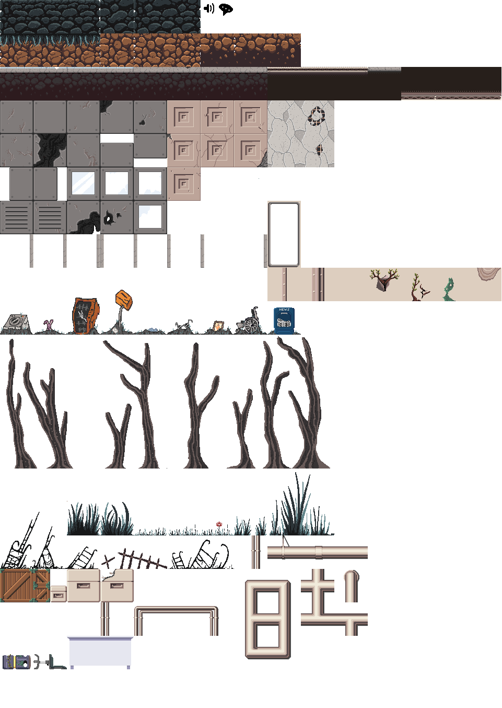

# Discussion

## Son

Il faut donner des retours sur les pistes sonores.

Système de layering avec différentes nappes sonores. Les sources sonores s'activent si le joueur est assez proche d'elles. On pourra placer ces sources sonores invisibles avec l'éditeur de niveaux.

## Graphismes

Présentation d'un premier tileset.

{ width=65% }

Discussion entre les équipes code et graphisme pour se mettre d'accord sur l'implémentation des animations et des pentes (lorsque le sol est incliné).

## Code

On est en train de travailler sur le système de collisions.

On va faire des tutoriels pour que l'équipe graphismes puisse synchroniser son travail sur `GitHub`.

On fera une syntaxe simple qui permettra de faire des cinématiques. On a prévu au moins les commandes suivantes :

- Déplacer un personnage
- Afficher un dialogue
- Déplacer la caméra de $(x, y)$ sur une durée $t$
- Faire un fondu
- Proposer un choix au joueur
- Faire des pauses

L'objectif est que les artistes puissent coder les cinématiques avec une syntaxe très simple. Il faudra aussi leur permettre de tester une cinématique.

## Scénario

Le scénario est finalisé.

Discussion à propos des cinématiques : comment faire si on n'a pas le temps de réaliser une cinématique trop complexe ? Il faut que les cinématiques n'utilisent pas trop d'animations uniques (cela représente beaucoup de travail) et soient basées sur des déplacements de personnages et des dialogues.

# Autres points

À la fin du jeu, on débloque un menu "Extras" avec des fiches de personnages, des concepts art…

Point de vue juridique : Mme Pirrone voit avec la juriste de CS pour le projet.

Prochaine réunion un jeudi à 18h avec Éléonore.