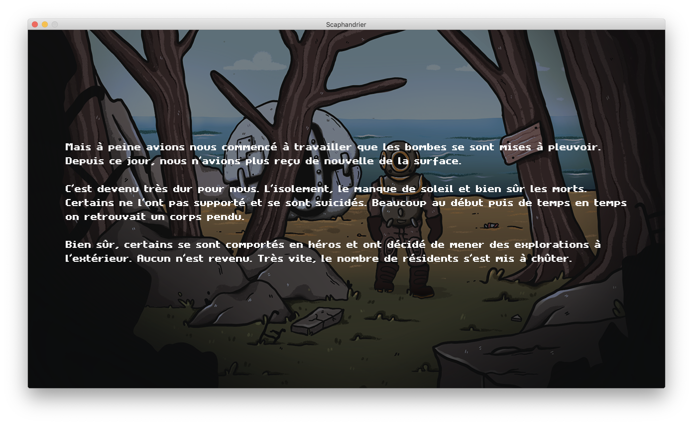
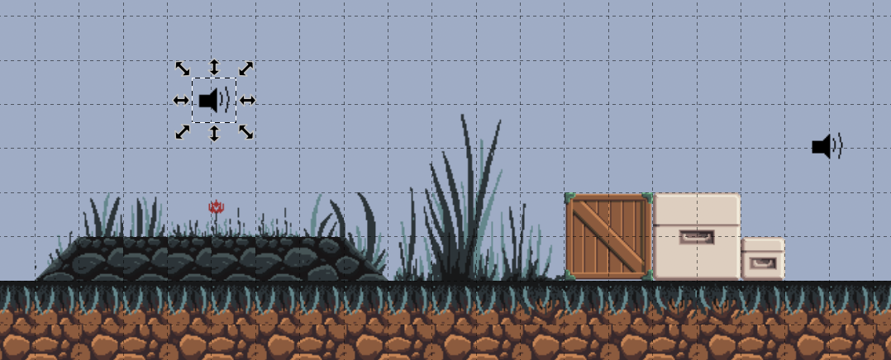

## Séance de travail

Nous avons fait une séance de travail centrée autour du travail sonore de Justine.

Nous avons travaillé sur les cinématiques dans le jeu.
À partir d'un fichier script `.xml` on décrit les cinématiques du jeu, par exemple :

```
<background Start>
<bgm 1_intro_radio_premiers_signaux>
<text>
[w]Mais à peine avions nous commencé à travailler que les bombes se sont mises à pleuvoir. 
Depuis ce jour, nous n'avions plus reçu de nouvelle de la surface.

C'est devenu très dur pour nous. L'isolement, le manque de soleil et bien sûr les morts.
Certains ne l'ont pas supporté et se sont suicidés. Beaucoup au début puis de temps en temps
on retrouvait un corps pendu.

Bien sûr, certains se sont comportés en héros et ont décidé de mener des explorations à
l'extérieur. Aucun n'est revenu. Très vite, le nombre de résidents s'est mis à chûter. 
</text>
```



Nous avons aussi travaillé sur les sources sonores : on peut placer dans les niveux des sources. On peut choisir le son joué, la portée et le volume de la source.



## Perspectives

Nous allons travailler sur les interactions avec des objets dans les niveaux (afficher des dialogues par exemple).

Il faut aussi ajouter les autres cinématiques ainsi que le reste des graphismes qui sont à venir.