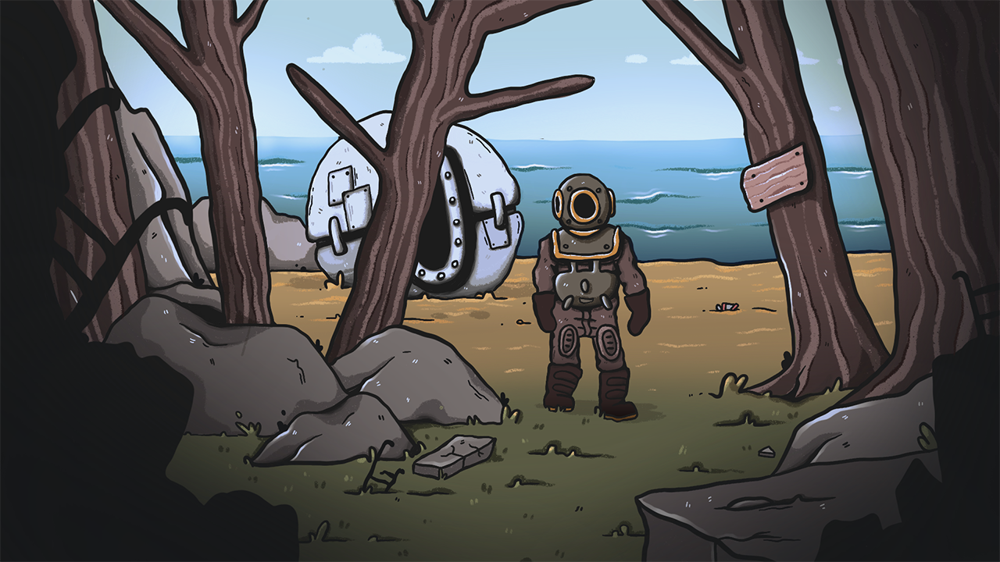

# Introduction

Ce projet est né de notre volonté de collaborer avec des étudiants de l'École Supérieure d'Art de Lorraine qui se situe à Metz. Cette école est liée à Supélec par une convention qui inclut la possibilité pour des élèves d'une école de prendre des cours dans l'autre --- dans les faits cette convention est uniquement utilisée pour un électif de première année du cursus Supélec. C'est cet électif qui a fait naître cette envie de collaboration.

La notion d'art dans le cursus Supélec est inexistante (mis à part dans l'électif cité précédemment), c'est pourquoi cette collaboration fait sens pour permettre de faire un projet pluridisciplinaire et abouti en s'éloignant d'un projet long "DIY".

Le jeu vidéo est une forme d'art qui mélange plusieurs disciplines : une partie visuelle avec des dessinateurs, une partie sonore avec des compositeurs, une partie narrative avec des écrivains, et une partie technique avec des programmeurs. Au cours de notre cursus nous avons été formé à la partie technique à travers les cours de génie logiciel et d'algorithmes. Les autres parties correspondent aux formations proposées par l'ÉSAL.

En moins d'un mois nous avons pu créer une équipe : quatre étudiants de l'ÉSAL ont été intéressés par notre proposition. L'équipe finale se compose de :

\begin{itemize}
    \item Élèves de CentraleSupélec:
    \begin{itemize}
        \item Nicolas Descouens
        \item Louis Vignier
    \end{itemize}
    \item Élèves de l'ÉSAL:
    \begin{itemize}
        \item Justine Allmang : Son
        \item Florian Ballié : Pixel Art
        \item Audrey Delay : Pixel Art
        \item Arthur Lambert : Scénario
    \end{itemize}
\end{itemize}

Nous avons été agréablement surpris de voir que le projet a suscité beaucoup d'intérêt à l'ÉSAL, chez l'encadrante Mme Bak, et chez les élèves : l'équipe d'artistes est finalement plus nombreuse que l'équipe d'élèves ingénieurs.

Dans la prochaine partie, nous détaillerons notre façon de travailler ainsi que les outils utilisés, puis nous détaillerons les points principaux du code.

# Organisation du travail

## Méthodologie

### Réunions

Pour présenter l'avancée de chacun sur le projet, nous nous sommes réunis à l'ÉSAL huit fois. Réunir tous les membres du projet a été difficile car les élèves artistes sont dans des années différentes ainsi que des cursus différents : tous les artistes n'étaient pas présents à chaque réunion.

Lors de la première réunion, nous avons établi un cahier des charges pour le projet. Mme Bak était présente lors de cette réunion et a d'abord dirigé la discussion sur ce que chacun de nous aimions pour faire ressortir l'aspect sensitif plutôt que l'aspect pragmatique (si on avait simplement parlé de nos compétences respectives par exemple). Il s'est trouvé que les différentes compétences de l'équipe se complétaient bien et couvraient les différents aspects d'un jeu vidéo.

Ces réunions ont été l'occasion de découvrir une nouvelle façon de penser et de parler car les artistes ont une approche projet différente des ingénieurs : on pourrait dire que les ingénieurs ont une façon très cadrée d'aborder un projet (en établissant un cahier des charges précis), alors que les artistes veulent explorer plein d'idées.

Pour rendre compte de l'avancée du projet, nous avons produit des compte-rendus de réunion à la fin de chaque réunion. Nous avons également fait une réunion avec M. Tavernier fin Décembre.

Cependant, le rythme des réunions (en moyenne une par mois) ne permet pas de se coordonner efficacement car il faut communiquer rapidement pour se mettre d'accord sur certains détails. C'est pourquoi nous avons mis en place un serveur Discord.

### Discord

Discord est une application de messagerie texuelle et vocale où les conversations sont regroupées en serveurs puis en salons. Nous avons donc créé un serveur dédié au projet et plusieurs salons pour séparer les conversations (général, graphismes, dev, son, scénario).

Tout le monde a adopté cet outil rapidement et nous l'avons beaucoup utilisé pour avoir un retour rapide sur quelque chose ou bien pour poser une question à un artiste.

### GitHub

Nous avons utilisé GitHub pour travailler à deux sur le code du jeu.

Nous avons rédigé un tutoriel sur Discord pour que les artistes puissent installer Git sur leur ordinateur et contribuer au projet sans avoir à nous envoyer de fichiers sur Discord. Justine et Florian se sont inscrits sur la plateforme mais uniquement Justine a réalisé des `commits` en ajoutant des sons.

## Cahier des charges

### Mise en place

Lors du démarrage du projet, nous avons fait valider un cahier des charges assez général dans le descriptif du projet en septembre 2018 :

\begin{enumerate}[i]
    \item Maîtriser des technologies récentes liées au jeu vidéo
    \item Se familiariser avec le travail en groupe au sein d'une équipe pluridisciplinaire
    \item Exploiter des connaissances de génie logiciel
\end{enumerate}

Nous avons parfaitement rempli ce cahier des charges dans le sens où nous avons produit un jeu jouable avec des artistes.
Une fois que l'équipe a été constituée, nous avons établi un second cahier des charges tous ensemble :

\begin{enumerate}[i]
    \item Créer un jeu en 2D
    \item Le gameplay est un jeu de plateforme avec une histoire
    \item Le jeu comporte un scénario avec plusieurs environnements et des boss
\end{enumerate}

Nous nous sommes rendus compte plus tard que ce cahier des charges était trop ambitieux : faire plusieurs environnements demande un travail graphique important, et les deux artistes en charge des graphismes ne pouvaient pas assumer cette charge de travail en parallèle de leurs cours à l'ÉSAL. En conséquence, nous avons redéfini les contours du projet le 19 Mars en adoptant le cahier des charges suivant :

\begin{enumerate}[i]
    \item Créer un jeu en 2D
    \item Le gameplay est un jeu de plateforme avec une histoire
    \item Le jeu comporte un scénario avec un seul environnement jouable
    \item Des cinématiques avec des fonds fixes permettent de simuler les autres environnements
\end{enumerate}

### Respect du cahier des charges

La mise en place d'un cahier des charges revu en Mars a permis de booster l'avancée du projet car nous avons pu nous concentrer sur un objectif accessible : implémenter le début du jeu (cinématique d'introduction et environnement de départ). 

!["La protagoniste est maintenant à la surface. [...] Elle porte une combinaison de plongeur et un casque de scaphandrier."](soutenance/assets/depart.png)

Au cours du projet, nous avons implémenté les mécaniques suivantes:

- Importation et affichage d'une carte au format `JSON`
- Création d'un moteur physique (gravité, déplacements, collisions)
- Gestion de la caméra (suit le joueur lorsqu'il quitte une "boîte" située au centre)
- Gestion du zoom et de la résolution du jeu
- Effet "parallaxe" sur le fond pour donner une impression de profondeur (le fond se déplace moins vite que la caméra)
- Importation et lecture de cinématiques
- Lecture de sons (une piste continue en fond et des sources ponctuelles qui peuvent s'ajouter)
- Interactions avec l'environnement avec une boîte de dialogue
- Menu pause
- Gestion des animations
- Gestions d'acteurs (comme le personnage) ayant une hitbox, des animations, et plusieurs états

Cependant, comme il manque des ressources graphiques (comme les graphismes de l'antagoniste par exemple), ainsi que du mapping, le jeu n'est pas fini. Pour autant, le projet est une réussite car chaque membre de l'équipe a vu comment son travail s'inscrit avec celui des autres. Comme le jeu est jouable, la collaboration entre les deux écoles est bien concrétisée. Par ailleurs, il faut garder à l'esprit que ce projet n'était pas valorisable pour tous les étudiants de l'ÉSAL dans leur cursus: il est normal que tout le monde n'ait pas pu travailler dessus en tant que projet de premier plan.

Les outils de travail étant mis en place, nous pourrons continuer d'alimenter en contenu le jeu lorsque de nouvelles ressources seront disponibles. Audrey a prouvé que travailler sur ce projet était utile car elle a décroché un emploi dans le secteur du jeu vidéo après avoir montré des graphismes en pixel art réalisés pour ce jeu ! Au cours de la dernière réunion nous avons envisagé de faire une page web simple pour mettre en valeur le jeu et pouvoir le partager ainsi que le télécharger: le projet continuera à vivre après le rendu pour Supélec.

Dans la partie suivante, nous détaillerons le fonctionnement des mécaniques principales.

# Programmation

## Principe général

### Framework `MonoGame`

Nous avons choisi de programmer en `C#` avec le framework `MonoGame`. Il s'agit d'un framework open source avec une communauté d'utilisateurs et de développeurs très active. Plusieurs jeux 2D récents ont été codés avec ce framework (entre autres Celeste, Stardew Valley, Axiom Verge, Flinthook, Towerfall Ascention), ce qui nous a conforté dans notre choix.

De plus, nous avions envie d'apprendre un nouveau langage pour gagner de nouvelles compétences: le `C#` nous a alors paru un très bon choix étant donné qu'il s'agit d'un langage plutôt récent (2003) par rapport au `C++` (années 80) et au `Java` (années 90).

Nous avons choisi d'utiliser un framework pour avoir des fonctions qui nous permettent de faire les tâches de base dans le code d'un jeu tel qu'afficher une image à l'écran ou jouer un son par exemple. Ainsi, on a plus de temps pour se concentrer sur les aspects intéressants du projet comme les collisions ou la gestion des sources sonores.

### UML

Sur la figure \ref{uml}, on représente le diagramme UML simplifié (sans les attributs et fonctions des classes pour plus de lisibilité). Nous avons séparé le code en 5 packages :

\begin{itemize}
    \item States : Contient le code lié à la gestion des différents états du jeu (cinématique, phases de plateforme, menu pause, etc…)
    \item Definitions : Contient les informations liées aux ressources graphiques (taille, nom), ainsi que des fonctions utilitaires (calculs, lecture de scripts, etc…)
    \item Entities : Contient le code lié aux acteurs tels que le joueur
    \item RenderEngine : Contient le code lié à la gestion de l'affichage (affichage du décor, de l'arrière-plan, du joueur, etc…)
    \item PhysicsEngine : Contient le code lié à la physique (collisions, gravité)
\end{itemize}

{ width=110% }

### Classe principale

`Game1` est la classe principale du projet : la fonction `Update` et la fonction `Draw` de `Game1` sont appelées 60 fois par seconde. 

Les classes représentant les états du jeu sont statiques car on a besoin que d'une instance unique de chaque état.

L'attribut `state` (voir figure \ref{uml}) indique dans quel état le jeu est actuellement : il est initialisé à `State.Cutscene` pour que le jeu s'ouvre sur la cinématique d'introduction.

Pour gérer l'affichage, on appelle la fonction `Draw` de l'état correspondant à la valeur de l'attribut `state` dans la fonction `Draw` de `Game1`. De même, pour gérer les mises à jour des autres composants du jeu comme les contrôles, on appelle la fonction `Update` de l'état correspondant dans la fonction `Update` de `Game1`. La fonction `Update` d'un état renvoie une variable de type `State`: c'est de cette manière que le jeu passe d'un état à un autre.

## Mécaniques implémentées

### Affichage du rendu du jeu

Le rendu est effectué grâce à la classe `Rendering`.

Tout le jeu est rendu en $1280\times720\text{px}$. La résolution s'adapte ensuite à l'écran de l'utilisateur, en comblant le manque par des bandes noires (figure \ref{bonRes} et \ref{badRes}). On effectue un zoom sur les différents sprites pour avoir la taille voulue.

### `Tilemap`: affichage de l'environnement

La réalisation d'un jeu de plates-formes nécessite un outil de création de niveaux. Nous avons utilisé le logiciel `Tiled`, un éditeur de cartes open source très populaire. Il est simple d'utilisation et permet d'exporter les cartes en `.json`, un format simple à lire ensuite.

Cet outil est central car il permet de relier plusieurs pans du jeu. Dans notre répertoire `git`, les cartes se trouvent dans `mono/Content/maps`.

#### Level Design

La première utilisation de Tiled est de faire le "mapping", c'est à dire placer les graphismes du jeu découpés en carreaux ("tiles") au bons endroits. Pour cela, chaque carte a 5 couches de tiles : `terrain` correspond aux blocs solides, `decorF` correspond au décor qui sera devant le joueur, et `decorB1` à `decorB3` correspondent à trois couches de décors derrière le joueur. Avoir plus de calques de décorations permet d'offrir plus de flexibilité aux graphistes pour jouer sur la profondeur.

Au niveau du code, on récupère les données de la carte correspondant aux tiles dans un tableau où les ID des tiles sont lus de gauche à droite en partant du tile en haut à gauche.

Les cartes comportent également un calque d'objets qui peuvent être de plusieurs natures.

#### `starting`

L'objet de type `starting` indique les coordonnées où le joueur apparait sur la carte.

#### Sources

Les objets de type `source` permettent de placer une source sonore invisible. On peut voir sur la figure \ref{tiled} les propriétés associées à ces objets : `id` indique la piste sonore de la source, `radius` indique le rayon au-delà duquel on n'entendra plus la source, et `volume` indique (de 0 à 100) le volume de la source au centre. Dans le code, on crée un objet `Source` pour chaque source. Dans la fonction `Update` de `Main`, on appelle la fonction `UpdateSources` de la `Tilemap` pour mettre à jour le volume des sources selon la position du joueur sur la carte. Ce système est intéressant car il permet de superposer plusieurs sources ainsi que de jouer sur le volume.

#### Interactions \label{interactions}

Les objets de type `text` permettent de créer une interaction : si le joueur appuie sur `E` à proximité d'un tel objet, une boîte de dialogue s'affichera. La propriété `content` permet de mettre en page ce dialogue en indiquant entre crochets le nom du personnage qui parle, et en utilisant `\n` pour faire un retour à la ligne. Sur la figure \ref{tiledTextBox}, on montre l'implémentation dans Tiled.

`[Sarah]La plupart sont en piteux état.\nJe n'arrive qu'à lire les gros titres.`

L'intérêt de ce code est de pouvoir être utilisable facilement par les artistes, et dans le code on récupère les différentes parties grâce à une expression régulière : `(\[([a-zA-Z? 0-9]*)\]([^\[]*))`.

### Les états

Le jeu est découpé en plusieurs états :

- `main`
- `pause`
- `cutscene`
- `TextBox`

Chaque état est appelé par l'état précédent et se gère de manière autonome, jusqu'à ce que son action soit terminée et qu'il appelle le prochain état.

#### `Main` : état principal

Il correspond à l'état principal du jeu. C'est notamment dans cet état que le joueur pour se déplacer dans le décors, intéragir avec les éléments.

#### `Pause` : menu pause

On met ici les déplacements du joueur et la physique du jeu en pause, tout en gardant l'affichage, et on place en avant plan deux boutons : "continuer" et "quitter". Nous avons aussi mis en place un filtre gris sur l'arrière plan pour bien signifier la pause, tout en faisant ressortir l'affichage des boutons (figure \ref{etatPause}).

 {width=85%}

De plus, pendant toute la durée où le menu pause est ouvert, une musique dédiée est jouée. et lors de la reprise du jeu dans l'état `main`, la musique reprend là où elle s'était arrêtée.

#### `Cutscene`: les cinématiques

L'environnement `Cutscene` correspond à l'affichage d'une image de fond, d'un texte et de la gestion de la musique, que ce soit une musique d'ambiance ou des effets sonores pour créer un environnement de cinématique cohérent (figure \ref{cutscene}).

Pour ce faire, on récupère dans un script les différentes ressources que l'on va gérer (figure \ref{scriptCutscene}).

{ width=70% }

Tout d'abord on récupère chaque action à effectuer et on les place dans une pile d'actions (figure \ref{pile_cutscene}). Chaque action sera ensuite dépilée en fonction de la précédente, il peut par exemple y avoir des actions bloquantes telles que `wait`.

{ width=70% }

Nous pouvons gérer comme actions :

- `background`, qui affiche une image de fond préchargé au lancement du jeu
- `text`, qui affiche le texte entre les balises et le centre, de plus, on peut controler la couleur de chaque ligne
- `newpage`, qui efface le texte à l'écran
- `wait`, qui interrompt le dépilement des actions pendant un nombre de frame donné
- `sfx`, qui joue un son sans le faire boucler
- `bgm`, qui joue un son d'ambiance en le faisant boucler
- `state`, qui change l'état actuel du jeu

On peut noter qu'à chaque changement d'image de fond, on opère un fondu au noir suivi d'un fondu au blanc pour améliorer la qualité de la transition. De plus, on applique un filtre noir sur cette image pour faire ressortir le texte.

#### `TextBox` : les dialogues

Cet état permet l'affichage de l'interaction du joueur avec le décor (figure \ref{textBox}). On utilise ici l'implémentation faite dans la partie \ref{interaction}. 

### La physique

La physique est simulée par l'applications de forces et du principe fondamental de la dynamique :
$$m\vec{a} = \sum_{}^{} \vec{F}$$

A partir de là on en déduit sa prochaine position et vitesse.

Le moteur physique dispose une liste de tous les acteurs du jeu. Dans l'état d'avancement de notre jeu, il n'y a que le joueur, mais on peut imaginer des ennemis, et d'autres protagonistes étant soumis à ce moteur physique.

De plus, chaque acteur peut collisioner avec des polygones, qui peuvent être ici des triangles et des rectangles (figure \ref{polygon}).

La résolution des collisions avec les polygones se fait en deux étapes. D'abord on vérifie que l'acteur rentre en collision avec un objet, et on récupère la liste d'objet avec lesquels il collisionne. Ensuite on va prendre un de ces polygones et calculer la position la plus probable sans collisions. On effectue ensuite récursivement la détection de nouvelles collisions avec les polygones, puis la résolution. Dans des situations normales de jeu, l'algorithme arrive toujours à trouver une position cohérente où le joueur n'entre pas en collision avec un élément.

Cependant, bien que les collisions avec les triangles fonctionnent, les artistes ont décidé de ne pas utiliser cet élément de jeu.

# Conclusion

Travailler sur ce projet aura été très enrichissant, car cela nous a permis de nous ouvrir à de nouveaux fonctionnements que celui très cadré des ingénieurs. Travailler dans une équipe avec des profils variés a été indispensable pour arriver à un résultat unique.

Ce projet montre bien l'aspect "conception" car nous avons conçu l'architecture du jeu (une partie liée au moteur physique, graphique, aux états du jeu et aux définitions variées), et nous avons défini et redéfini les contours du projet avec les artistes.

Le travail en groupe a permis d'avoir un projet complet comportant des graphismes et des sons, mais nous a parfois ralenti dans notre travail : nous avons préféré attendre de recevoir les graphismes liés à une fonctionnalité avant de l'ajouter en jeu, ce qui nous a fait fortement dépendre du travail graphique.

# Annexes

{ width=70% }

